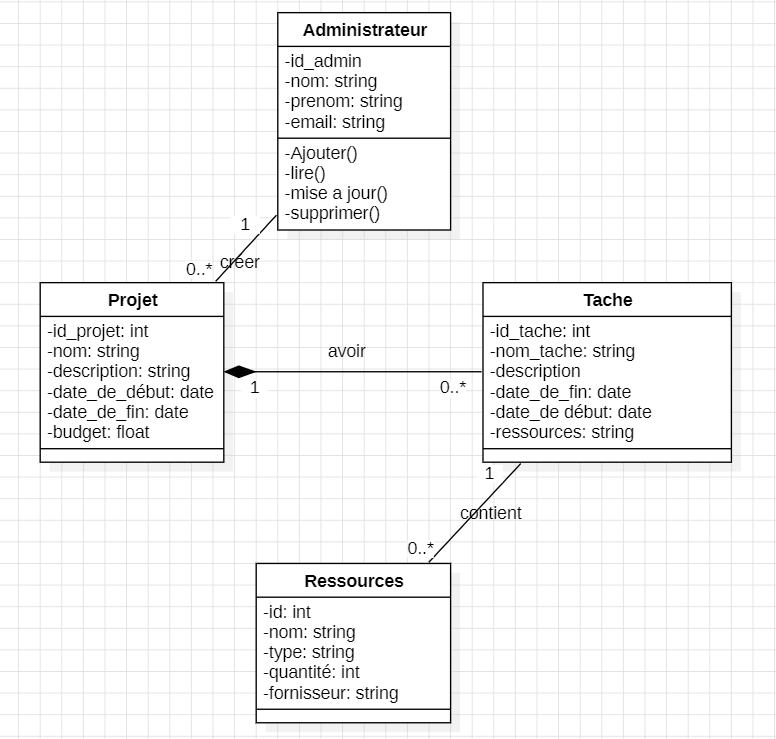

# ConstructionXpert Services - Application de Gestion de Projets de Construction

## Description

L'application **ConstructionXpert Services** est une solution web permettant à une équipe de construction de gérer efficacement les projets de construction. Elle permet de créer et de gérer des projets, d'assigner des tâches aux membres de l'équipe, de gérer les ressources nécessaires et de suivre l'avancement des projets. Cette application offre une interface conviviale pour visualiser, mettre à jour et supprimer des projets ainsi que leurs tâches et ressources associées.

## Fonctionnalités

### En tant qu'administrateur, vous pouvez :

#### Gestion des Projets
- Créer un nouveau projet avec les informations suivantes : nom, description, date de début, date de fin, budget.
- Afficher la liste des projets existants avec leurs détails.
- Mettre à jour les détails d'un projet existant.
- Supprimer un projet existant.

#### Gestion des Tâches
- Créer une nouvelle tâche pour un projet avec la description, date de début, date de fin et les ressources nécessaires.
- Afficher la liste des tâches associées à un projet avec leurs détails.
- Mettre à jour les détails d'une tâche existante.
- Supprimer une tâche existante.

#### Gestion des Ressources
- Ajouter de nouvelles ressources avec les informations suivantes : nom, type, quantité, fournisseur.
- Afficher la liste des ressources disponibles avec leurs détails.
- Mettre à jour les détails d'une ressource existante.
- Supprimer une ressource existante.
- Mettre à jour la quantité de ressources après chaque assignation à une tâche.


## Technologies et Outils Utilisés

- **Langage de Programmation** : Java
- **Framework Web** : Java EE (Servlets, JSP)
- **Base de Données** : MySQL
- **JDBC API** : Pour la communication entre l'application Java et la base de données
- **Serveur d'Application** : Apache Tomcat
- **Front-end** : HTML, CSS (Bootstrap), JavaScript
- **Maquette** : Figma
- **Système de Gestion de Versions** : Git

## Conception UML

Les diagrammes UML fournis dans ce projet comprennent :
- **Diagramme de Classes**

- **Diagramme de Cas d'Utilisation**

- **Diagramme de Séquence**

## Planification du Projet

La planification a été réalisée à l'aide de [Trello](https://trello.com/invite/b/67d80da6dcf4b278d9c8fc07/ATTIa556d07c5275e2ee118384adacf1f2753330CE2B/constructionxpert-services) pour suivre les tâches et les délais.

### Prérequis

- Java 8 ou version supérieure
- Serveur Apache Tomcat (ou tout autre serveur d'application compatible Java EE)
- MySQL pour la base de données

### Étapes d'installation

1. **Cloner le repository GitHub** :
   ```bash
   git clone https://github.com/MrRidadev/ConstructionXpert-Services.git


